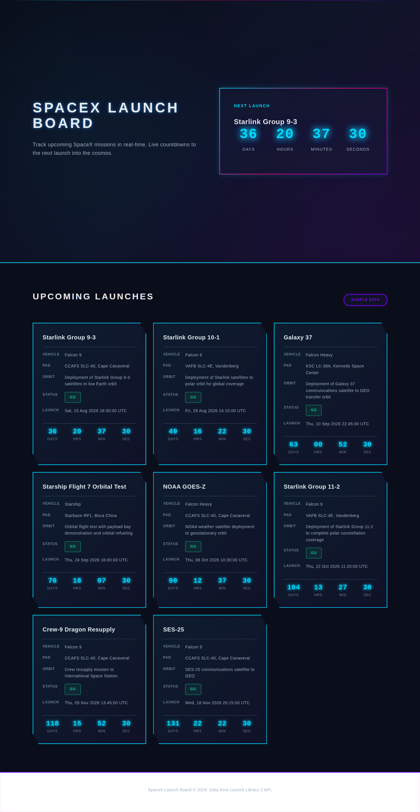

# SpaceX Launch Board — built end-to-end by two goaly runs

A demo of goaly's `--adversarial` mode with a **cheap worker and an expensive set of validators**:
the coding agent ran on Haiku 4.5 while the compiler, judge quorum, adversarial critics/refuters,
and the Sign-off approver panel all ran on Opus 4.8. Run 1 built the board from scratch; run 2 — a
`--from-run` follow-up — redesigned it into the current futuristic **neon crystal** style.



## What was built

A self-contained single-page site (`index.html`, no build step, no external dependencies) showing
upcoming SpaceX launches: a hero with a featured next-launch countdown, a launch board of 8 cards
(mission, vehicle, pad, orbit/payload, status, UTC time), live per-card T-minus countdowns ticking
every second, a Launch Library 2 live fetch with a bundled offline sample fallback and a data-source
indicator. The design system (`DESIGN.md`) documents the neon prism palette (electric cyan / hot
magenta / ultraviolet over near-black), faceted glass-shard cards (`clip-path` + `backdrop-filter`),
glow treatments, type + spacing scales, grid, and reduced-motion rules.

`verify.mjs` is the frozen verification run 2's compiler authored (jsdom, fetch stubbed to reject,
`Date` frozen). Run it with `npm install --no-save jsdom` then `node --test verify.mjs` from a
directory where `index.html` and `DESIGN.md` sit at the root.

## The invocations

```bash
# Run 1 — build the board from scratch
goaly run \
  --goal-file goal.txt --intent-file intent.txt \
  --autonomous --adversarial \
  --model claude-haiku-4-5-20251001 \
  --llm-model claude-opus-4-8 \
  --max-iterations 6 --budget-tokens 8000000

# Run 2 — follow-up: redesign into neon crystal, aware of run 1's outcome
goaly run --from-run run-f74f57aa-831e-404c-8edb-61391c9f8115 \
  --goal-file goal2.txt --intent-file intent.txt \
  --autonomous --adversarial \
  --model claude-haiku-4-5-20251001 \
  --llm-model claude-opus-4-8 \
  --max-iterations 6 --budget-tokens 8000000
```

- `--model` (the harness/worker) → Haiku 4.5 — the cheap executor.
- `--llm-model` (compiler / judge / approver, and via the critic-model cascade also the
  adversarial contract critics and refuters) → Opus 4.8.
- `--adversarial` red-teamed each compiled contract before Seal, appended a 3-vote refuter rung
  after the frozen ladder, and widened Sign-off to a 3-reviewer panel.

## How the runs went

| | Run 1 (build) | Run 2 (neon crystal redesign) |
| --- | --- | --- |
| run id | `run-f74f57aa-831e-404c-8edb-61391c9f8115` | `run-b085cc35-6daf-4d6a-8361-c0cbe976ba1a` |
| contract hash | `fbac0a0f…5cb1f` | `5e13c1cc…2eeb1e` |
| red-team pre-Seal | 1 critical finding → 1 re-author round | 3 critical findings → 1 re-author round |
| outcome | **DONE** (two keys) | **DONE** (two keys) |
| iterations | 3 | 1 |
| ladder confidence | 0.855 | 0.81 |
| total spend | ~3.19M tokens | ~3.76M tokens |

Run 2's re-authored contract is a nice showcase of what the adversarial critics buy: instead of
grepping the stylesheet for neon keywords (trivially gameable), the frozen test walks the parsed
CSSOM and asserts the `clip-path` facets, `backdrop-filter` glass, and glow shadows are **bound to
the actual launch-card elements** (pseudo-classes stripped, media blocks flattened, with a decoy
unused-selector rule that must NOT count), that the pre-redesign tree fails the bar, and that
functionality (countdown math, fallback data, hooks, landmarks) did not regress.

Operational notes from run 1 (the interesting part of the demo):

- Iterations 1–2 ended with the judge **unevaluable** — the sandbox's `.gitignore` didn't exclude
  `node_modules/` (created by the contract's own one-time `npm install --no-save jsdom` setup), so
  goaly's diff — which deliberately includes untracked files *with content* so the judge can review
  a from-scratch build — ballooned to megabytes and the judge CLI choked on it. goaly stayed
  fail-closed the whole way: the broken judge was never a green, and the run aborted as
  `CONTRACT_UNEVALUABLE` ("your tree may be correct but is UNVERIFIED") rather than fabricating a
  verdict.
- After adding `node_modules/` to the sandbox `.gitignore`, `--resume` re-entered the loop from the
  write-ahead log and finished: same frozen contract, same hash, no work repeated.
- Resumes must re-pass the wiring flags (`--model` / `--llm-model` / `--adversarial`) — model
  selection is per-invocation, only the contract is frozen.
- The oversized-prompt child dying mid-stdin-write also surfaced a real crash bug in goaly
  (unhandled `EPIPE` in `src/util/spawn.ts`), filed as
  [#101](https://github.com/krimvp/goaly/issues/101).
